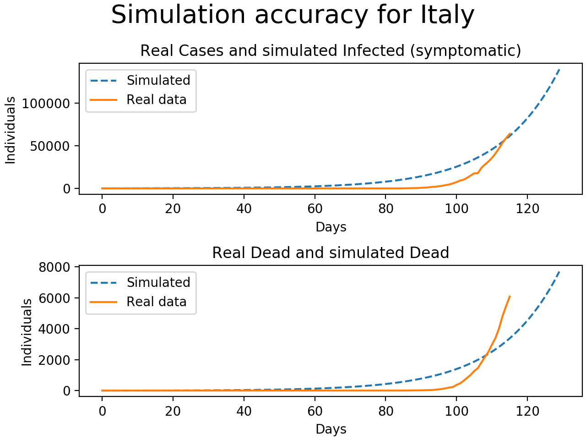

# Coronavirus
Basic modelling of the global spread of coronavirus

Each country has a population and is part of a air traffic network.
Each population responds to the virus according to the SEIR model.
Initial values for number of infected per country.

<b>NOTE</b> that this model is extremely oversimplified, inaccurate (see figure below) and is in no way verified in predicting the future. It's mostly fun to play around with the numbers to see how certain parameters and strategies affect spread.

